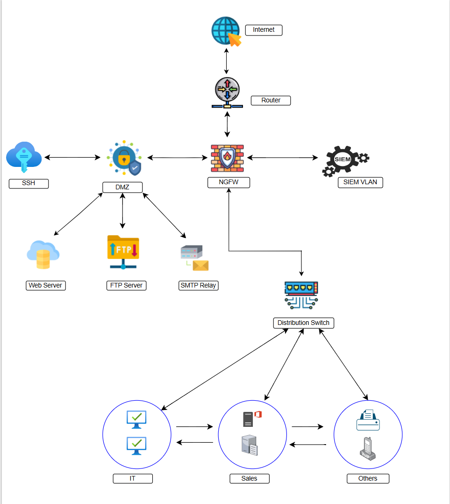

# SecureNet: Layered Defense Architecture
A comprehensive enterprise security lab focused on defense-in-depth, centralized monitoring, and automated patch management.

## Network Architecture

## 🛠️ Tech Stack
* **Firewall/Routing:** pfSense (Network Segmentation & VLANs)
* **SIEM/Monitoring:** Splunk (Centralized Log Analysis)
* **Identity & Updates:** Windows Server (AD & WSUS)
* **Automation:** Ansible (Patch Management)
* **Vulnerability Management:** Nessus
* **Infrastructure:** Ubuntu Servers (DMZ), Kali Linux (Adversarial Testing)

## 🏗️ Project Overview
This project simulates a corporate environment with segmented networks (DMZ, LAN, Management). The goal was to build a resilient infrastructure that can detect and mitigate common attack vectors.

### Key Features
- **Network Segmentation:** Isolated public-facing services in a DMZ using pfSense rules.
- **Automated Security:** Implemented Ansible playbooks for automated Linux patching.
- **Centralized Logging:** Configured Splunk to ingest logs from pfSense and Windows endpoints for real-time alerting.
- **Hardening:** Applied security benchmarks to Windows and Ubuntu systems to reduce the attack surface.

## Vulnerability Management: 
I used Nessus to identify critical SSL/TLS weaknesses and verified their remediation after hardening the DMZ servers.
  

## 🛡️ Methodology & Validation
Validated the architecture by performing:
1. **Nessus Scans:** Identified and remediated vulnerabilities.
2. **Adversarial Simulation:** Attempted lateral movement from the external network to test pfSense firewall rules.

> **Note:** All testing was performed in an isolated virtual lab environment. IP addresses shown in documentation (192.168.x.x) are non-routable internal addresses.

